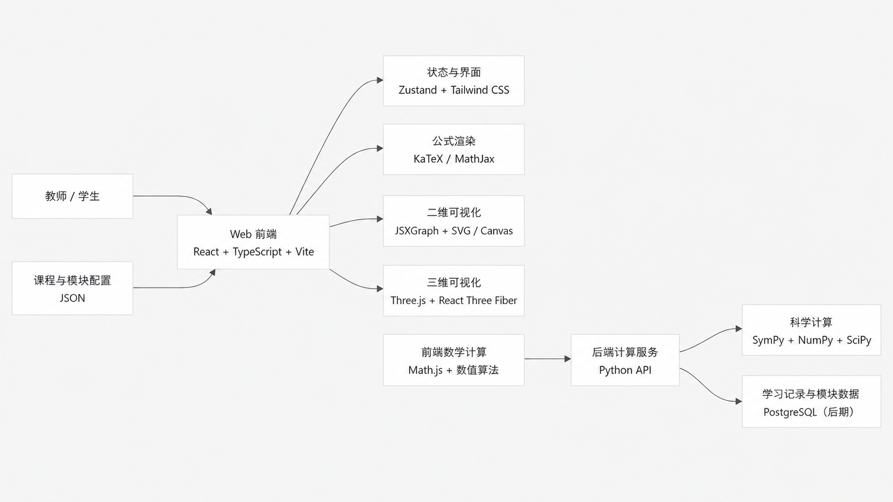

# 数学之美（MathViz）

面向数学教学的交互式可视化实验平台。项目通过动态图形、公式、数值计算和参数操作，将抽象数学概念转化为可以观察、操作和验证的数学实验。

本仓库当前作为“数学教学可视化展示系统建设”项目的开发基础，现阶段重点是整理已有实验模块、建立统一模块规范，并实现自然语言问题到可视化实验的智能路由。



## 项目目标

- 为教师提供可暂停、可单步操作的课堂演示工具。
- 为学生提供可重复探索的数学实验环境。
- 联动展示公式、图像、参数、数值结果和教学结论。
- 沉淀可复用的二维、三维、公式和动画组件。
- 建立数学内容审核、功能测试和教学验收流程。

## 当前开发进展

- 已补充项目根目录 README 和技术栈架构图。
- 已修复 Windows 中文目录下 Plotly 自定义别名无法解析的问题。
- 已同步前端 Fuse.js、pinyin-pro 搜索依赖与 npm 锁文件。
- 已实现第一版数学问题意图分类器，可识别可视化、解释、计算、比较和查找实验等意图。
- 已建立统一实验 Manifest：全部 300 个实验均可按标题安全召回，其中核心配置和高置信度自动推断结果可参与扩展语义匹配。
- 已实现实验候选评分和 `direct`、`suggest`、`ai`、`no-match` 四类路由决策。
- 已处理实验标题意图污染、长短标题冲突和常见自然语言插词；支持操作意图与数学知识文本拆分，以及核心标题、别名、关键词与文本相似度的渐进式匹配。
- 已将候选标记为 `exact`、`strong`、`related` 三档；相近文本命中只能推荐，不能触发自动跳转。
- 已在前端首页接入“智能实验导航”输入框，支持直接跳转、实验建议、待确认和无匹配四类交互。
- 已提供 Agent HTTP 接口和对应的 Node.js 自动化测试。
- 已接入规则优先的双模型 Agent：`deepseek-v4-flash` 负责主路由，`qwen3.7-plus` 在低置信度、查询改写、追问、工具请求和未命中时进行复核，并在主模型异常时接管。
- 已为模型输出增加 JSON 结构校验、实验 ID 白名单和安全降级；AI 不能编造已有页面路径或直接执行代码。
- 已支持从自然语言中提取已有实验的初始参数；例如“用方块演示 23 - 8”会打开原有四则运算页，并自动设置运算类型和数字。
- 已接通人工确认后的临时实验生成：没有合适预设实验时，可由 DeepSeek 生成受限配置、千问复核，并交给统一渲染器执行，不写入源码或永久路由。
- 临时实验页复用现有 300 个实验的侧栏、卡片、公式、参数面板、步骤控制和知识点布局，当前支持直角坐标函数、极坐标曲线和基础四则运算三类渲染器。
- 生成入口只对具有可视化、表达式或数学模拟特征的问题开放；天气、闲聊以及不适合当前渲染器的纯讲解问题不会进入实验生成。
- 完整实验配置使用独立的模型输出预算，并由本地规则补充二次项系数取零等关键退化情况，避免复杂配置被截断或遗漏课堂边界。

下一步将继续扩充安全渲染器、完善数学内容审核和离线评测，并把通过教师审核的临时实验转成可维护的正式实验模块。

## 当前能力

- 约 300 个数学实验入口，覆盖小学数学、中学数学、微积分、线性代数、概率统计、数值分析、离散数学和应用数学等方向。
- 按学习阶段和数学主题进行分类、筛选和导航。
- 支持标题、描述、拼音和多关键词模糊搜索。
- 支持二维函数图像、三维图形、数值模拟、动画和分步讲解。
- 支持 KaTeX 公式展示以及 Math.js 数学计算。
- 包含实验讲解、语音资源、问题反馈和简单后台管理能力。
- 已为大量数学算法配置 Vitest 单元测试。
- 后端已具备规则驱动的数学意图识别、实验匹配和路由决策 MVP。
- 首页支持使用自然语言查找并带参数进入已有数学实验。
- 用户确认后可以为未命中需求生成临时交互实验，且页面结构与现有实验保持一致。

> 当前仓库包含较多独立实验页面。后续开发的重点不是单纯增加页面数量，而是统一模块定义、参数协议、路由方式和质量标准。

## 技术栈

| 层级 | 技术 |
| --- | --- |
| 前端框架 | React 19、TypeScript、Vite |
| 页面路由 | React Router |
| 界面样式 | Tailwind CSS |
| 二维与数据可视化 | Plotly.js、SVG、Canvas |
| 数学公式 | KaTeX、React KaTeX |
| 数学计算 | Math.js、自定义数值算法 |
| 搜索 | Fuse.js、pinyin-pro |
| 前端测试 | Vitest |
| 后端服务 | Node.js、Express、TypeScript |
| Agent 路由与生成 | 规则意图分类、实验注册表、候选评分、参数提取、DeepSeek 主路由/生成、千问复核与故障接管 |
| 后端测试 | Node.js Test Runner、tsx |
| 当前数据存储 | LowDB / JSON |

## 项目结构

```text
mathviz/
├─ client/                         # React 前端
│  ├─ public/                      # 静态资源与讲解音频
│  ├─ docs/                        # 讲解与内容制作说明
│  ├─ scripts/                     # 内容检查、导出和音频脚本
│  └─ src/
│     ├─ components/               # 通用界面、公式、参数和讲解组件
│     ├─ contexts/                 # React 上下文
│     ├─ experiments/              # 数学实验页面、算法和测试
│     ├─ narrations/               # 实验讲解脚本
│     ├─ pages/                    # 独立业务页面
│     ├─ App.tsx                   # 页面路由入口
│     └─ main.tsx                  # 前端启动入口
├─ server/                         # Express 后端
│  ├─ scripts/                     # Manifest 生成、报告和搜索评估
│  └─ src/
│     ├─ agent/                    # 意图识别、Manifest、实验匹配与路由决策
│     ├─ db/                       # LowDB 数据访问
│     ├─ routes/                   # Agent、实验与问题反馈接口
│     └─ index.ts                  # 服务启动入口
├─ package.json                    # 根目录开发脚本
├─ LICENSE                         # 非商业许可
└─ COMMERCIAL-LICENSE.md           # 商业授权说明
```

## 快速开始

### 环境要求

- Node.js 20 LTS 或更高版本
- npm
- Git

### 获取并安装依赖

```bash
git clone https://github.com/zhangifonly/mathviz.git
cd mathviz
npm run install:all
```

### 启动前后端开发服务

```bash
npm run dev
```

默认情况下：

- 前端由 Vite 启动，通常访问 `http://localhost:5173`。
- 后端监听 `http://localhost:3001`。
- 后端健康检查地址为 `http://localhost:3001/api/health`。

也可以分别启动：

```bash
npm run dev:client
npm run dev:server
```

> 前端业务接口使用 `/api` 相对路径。开发模式已经由 Vite 代理到 `http://localhost:3001`；生产部署仍需配置统一反向代理。

### 配置双模型 Agent

先复制后端环境变量模板：

```powershell
Copy-Item server/.env.example server/.env
```

然后只在本机的 `server/.env` 中填写 `DEEPSEEK_API_KEY` 和 `QWEN_API_KEY`。`.env` 已被 Git 忽略，禁止把真实密钥写入源码、README、提交记录或前端环境变量。若密钥曾在聊天、截图或日志中明文出现，应先在服务商控制台轮换后再使用。

默认模型与接口：

- DeepSeek 主模型：`deepseek-v4-flash`，OpenAI 兼容地址 `https://api.deepseek.com/v1`。
- 千问复核模型：`qwen3.7-plus`，中国内地北京地域兼容地址 `https://dashscope.aliyuncs.com/compatible-mode/v1`。
- 任一密钥缺失时，已配置的模型可以独立工作；两个模型都未配置或 `AGENT_AI_ENABLED=false` 时，系统自动退回纯规则路由。
- 普通路由调用可分别通过 `DEEPSEEK_TIMEOUT_MS`、`QWEN_TIMEOUT_MS` 调整超时；临时实验生成至少保留 20 秒，以便输出和复核完整配置。

模型调用只发生在歧义候选、相近候选、混合意图或未命中场景。完整标题和强语义已经产生明确结果时继续使用本地规则，不增加外部调用延迟和费用。

## 常用命令

### 前端

```bash
cd client
npm run dev             # 启动开发服务
npm run build           # 类型检查并构建
npm run lint            # ESLint 检查
npm run test            # 运行单元测试
npm run test:watch      # 监听模式运行测试
npm run check-courses   # 检查课程数据完整性
```

### 后端

```bash
cd server
npm run dev             # 监听文件变化并启动服务
npm run build           # 编译 TypeScript
npm run test            # 运行全部后端测试
npm run test:intent     # 仅运行意图分类测试
npm run start           # 运行编译后的服务
npm run generate:manifests       # 从前端实验目录重新生成 Manifest
npm run check:manifests          # 检查生成文件是否与前端目录同步
npm run typecheck:scripts        # 检查后端维护脚本类型
npm run report:manifests         # 查看自动推断和启用情况
npm run evaluate:search          # 评估标题搜索及最终路由决策
npm run evaluate:semantic-search # 评估不含实验标题的语义问题
```

生产或共享环境必须通过环境变量设置管理密码，不应使用源码中的开发默认值：

```powershell
$env:ADMIN_PASSWORD="replace-with-a-strong-password"
npm run dev:server
```

## 后端接口概览

| 方法 | 路径 | 用途 |
| --- | --- | --- |
| `GET` | `/api/health` | 服务健康检查 |
| `GET` | `/api/experiments` | 获取实验记录 |
| `POST` | `/api/experiments` | 新建实验记录 |
| `GET` | `/api/experiments/:id` | 获取单个实验记录 |
| `PUT` | `/api/experiments/:id` | 更新实验记录 |
| `DELETE` | `/api/experiments/:id` | 删除实验记录 |
| `POST` | `/api/agent/intent` | 识别用户问题的操作意图 |
| `POST` | `/api/agent/route` | 识别意图、匹配实验并生成路由决策 |
| `POST` | `/api/agent/generate` | 在用户确认后生成并校验临时交互实验配置 |
| `GET` | `/api/agent/status` | 查看不含密钥的 Agent 启用状态、模型名称和工具规划 |
| `POST` | `/api/bugs` | 提交问题反馈 |
| `POST` | `/api/admin/login` | 后台管理认证 |

### Agent 路由示例

```bash
curl -X POST http://localhost:3001/api/agent/route \
  -H "Content-Type: application/json" \
  -d '{"question":"动态演示黎曼和的逼近过程"}'
```

路由接口当前可能返回以下决策：

- `direct`：意图和实验均明确，可以直接进入实验。
- `suggest`：实验明确但操作意图不够清晰，或仅找到若干相近候选，先展示建议。
- `ai`：模型要求补充信息或提出受控工具请求，需要用户进一步确认。
- `no-match`：未识别到相关数学实验。

Agent 始终先运行本地规则。只有规则结果不明确时，DeepSeek 才会输出结构化路由建议；查询改写、低置信度、追问、工具请求和未命中结果会交给千问复核。主模型超时或异常时由千问接管，两个模型都失败时保留原规则结果。

模型只能从服务器提供的候选 ID 中选择。即使模型建议了实验，最终页面路径仍由本地注册表解析，且 AI 增强结果不会触发自动跳转。模型可以提出以下工具请求：

- `search-experiments`：后续接入扩展实验库搜索。
- `create-experiment`：显示人工确认入口；只有用户点击后才调用 `/api/agent/generate` 生成临时预览。

临时实验不是任意代码生成。服务端只接受受限 `DynamicExperimentSpec`，表达式仅允许白名单内的变量、常量和数学函数，并限制参数数量、取值范围、采样数量、步骤数量和文本长度。前端在写入会话存储和渲染前还会再次校验；配置只在当前浏览器会话中使用，不会自动创建文件、修改 300 个正式实验或注册永久路由。

接口响应中的 `analysis` 会返回拆分后的 `knowledgeText` 和 `knowledgeTerms`；每个候选的 `matchQuality` 用于区分完整标题、强语义和相近文本命中。

实验注册表由 `client/src/experiments/catalog.ts` 自动生成。全部实验都能通过标题参与基础召回，只有 `agent.enabled=true` 的高置信度配置会使用自动别名和关键词。开发服务启动前会刷新生成文件，测试会检查生成文件是否过期；新增或修改实验目录后，也可以手动运行 `npm run generate:manifests`。

## 新增实验模块

新增实验时，至少完成以下工作：

1. 在 `client/src/experiments/<module-name>/` 中创建实验页面。
2. 将数学计算与 React 页面渲染分离，核心算法使用独立 TypeScript 文件。
3. 为数学算法添加边界值、特殊值和异常输入测试。
4. 在 `client/src/experiments/catalog.ts` 中登记标题、描述、难度和主题。
5. 在 `server` 目录运行 `npm run generate:manifests`，同步 Agent 实验目录。
6. 在 `client/src/App.tsx` 中配置懒加载和页面路由。
7. 检查侧边栏、课程数据和讲解脚本等关联入口。
8. 依次运行 Manifest 同步检查、搜索评估、课程完整性检查、单元测试、Lint 和生产构建。

实验模块应优先保证：

- 数学公式、图像和数值结果正确。
- 参数范围明确，非法输入得到处理。
- 动画能够暂停、重置，并在需要时支持单步操作。
- 公式、图像、参数和文字结论同步变化。
- 页面能够在常用桌面和移动端尺寸下正常使用。

## 下一阶段规划

- 根据真实课堂问题继续完善输入框提示、候选解释和交互反馈。
- 建立离线 Agent 评测集，分别统计规则命中率、主模型纠错率、复核一致率、延迟和调用成本。
- 实现 `search-experiments` Skill，并设计“临时实验 → 教师审核 → 正式实验模块”的发布流程。
- 将函数表达式、区间、精度等参数提取扩展到更多已有实验。
- 继续将页面入口、目录、讲解和参数 Schema 收敛到统一 Manifest。
- 扩展受限 `DynamicExperimentSpec` 的安全渲染器类型，逐步覆盖几何构造、统计图和数值模拟。
- 建立标准测试问题集，评估模块命中率、数学正确性和渲染稳定性。
- 对规则置信度进行真实语料校准，降低错误直接跳转率。

## 开发原则

- 数学正确性优先于视觉效果。
- 通用能力组件化，避免重复实现坐标系、参数控件和动画控制。
- AI 只生成经过 Schema 校验的结构化配置，不直接执行任意代码。
- 每个模块明确开发负责人、数学审核人和验收标准。
- 不在仓库中提交密码、密钥、个人信息或其他敏感数据。

## 许可

本项目采用双授权模式：

- 非商业用途遵循 [PolyForm Noncommercial License 1.0.0](./LICENSE)。
- 商业用途请参阅 [商业授权说明](./COMMERCIAL-LICENSE.md)。

第三方依赖分别遵循其各自的软件许可。

## 上游项目

- GitHub：<https://github.com/zhangifonly/mathviz>
