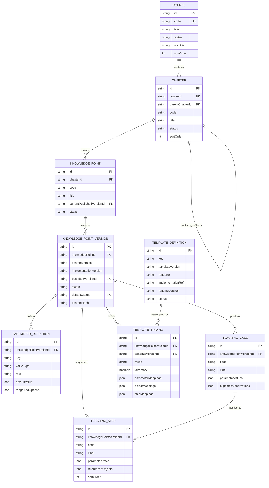
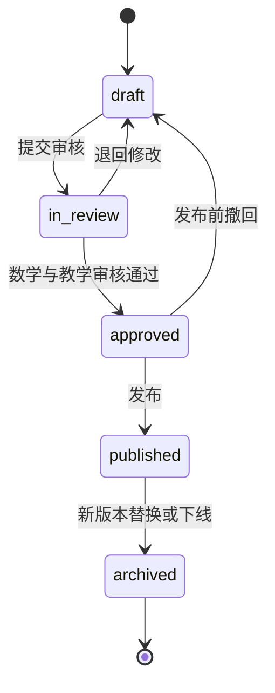

# 知识点内容数据模型设计（V1）

## 1. 目标

本模型用于承接客户提供的知识点内容整理信息，并支持：

- 课程—章节—知识点目录；
- 审核后的默认案例和探索案例；
- 参数、公式、语义对象和教学步骤联动；
- 知识点内容版本与模板实现版本稳定复现；
- 草稿、审核、发布、归档和回退；
- Agent 路由、上下文问答和统一渲染运行时读取同一份可信数据。

领域类型位于：

- `server/src/content/types.ts`
- `server/src/content/validation.ts`

V1 只确定稳定的领域协议和约束，不绑定 LowDB 或 PostgreSQL。持久化层后续通过 Repository 适配，不应让数据库字段反向污染内容协议。

## 2. 核心原则

### 2.1 稳定身份与可变内容分离

- `KnowledgePoint` 是长期稳定的知识点身份和目录入口。
- `KnowledgePointVersion` 是一次可审核、可发布、可复现的内容快照。
- 案例、参数、步骤和模板绑定全部属于具体知识点版本。
- `published` 版本不可原位修改；修改必须从旧版本创建新 `draft`。

### 2.2 内容版本与实现版本分离

- `contentVersion`：教学内容语义版本，例如 `1.2.0`。
- `implementationVersion`：前端/运行时实现标识，例如 Git SHA。
- `TemplateDefinition.templateVersion`：模板自身的版本。
- `TemplateBinding` 固定到具体模板版本，不能运行时自动漂移到最新版。

因此一次可复现加载至少需要：

```text
knowledgePointId
+ knowledgePointVersionId
+ contentVersion
+ implementationVersion
+ templateVersionId
+ caseId
+ runtime state
```

### 2.3 数学对象必须具有可信来源

公式和语义对象使用 `valueSource` 标记来源：

- `math-engine`：导数、积分、斜率、关键点、条件判定等可信数学结果；
- `template-runtime`：画布坐标、可见对象和动画状态；
- `content`：经过审核的定义、标题和教学文案。

大模型可以读取这些结果组织解释，但不能把模型计算结果反写成可信数学状态。

## 3. 关系模型



## 4. 实体职责

### 4.1 Course

课程是目录顶层，例如“高中数学”“微积分”。负责：

- 稳定 `code`；
- 标题、描述和排序；
- 发布状态；
- `public / restricted / private` 可见性。

课程不保存具体参数、公式或模板信息。

### 4.2 Chapter

章节必须属于一个课程，例如“导数及其应用”。`parentChapterId=null` 表示教材章节，非空表示章节下的小节，从而覆盖新版前端“章节—小节—知识点”的目录结构。章节 `code` 在同一父级内唯一。

已发布章节的父课程和父章节必须已发布；父章节必须与子章节属于同一课程，并禁止循环引用。

### 4.3 KnowledgePoint

知识点是路由、URL、AI 会话和目录高亮使用的稳定 ID，例如：

```text
kp-epsilon-delta
kp-derivative-geometric
kp-rolle-theorem
```

它只保存标题、摘要、别名、标签和当前发布版本指针，不直接保存可变教学内容。

### 4.4 KnowledgePointVersion

版本承载一次完整教学交付，包括：

- 学习目标与前置知识；
- 概念定义、教学提示和边界说明；
- 语义对象和公式；
- 默认案例指针；
- 数学、功能、教学、性能和维护性验收规则；
- 内容哈希、审核和发布记录；
- 内容版本和实现版本。

`contentHash` 应由规范化后的版本聚合计算，建议使用 SHA-256，用于检测发布后内容是否被修改。

### 4.5 ParameterDefinition

参数定义是内容表单、运行时控件、URL 状态和 AI 上下文共用的协议。

支持：

- `number`：范围、步长、单位；
- `boolean`：条件开关；
- `enum`：函数或案例选项；
- `expression`：经过安全解析的数学表达式；
- `text`：非数学自由文本。

`role` 含义：

- `input`：允许用户调整；
- `computed`：数学引擎计算，用户不可直接修改；
- `display`：只用于展示内容状态。

### 4.6 TeachingCase

案例保存一组审核后的参数状态和预期观察。V1 类型：

- `default`：首次进入必须加载；每版本必须且只能有一个；
- `exploration`：可切换的探索案例；
- `boundary`：边界值；
- `counterexample`：条件不成立时的反例；
- `summary`：总结状态。

案例不能创建未在 `ParameterDefinition` 中声明的参数。

### 4.7 TeachingStep

步骤描述教学过程，不直接执行任意代码。每一步包含：

- 操作指令；
- 观察问题；
- 需要高亮的语义对象；
- 关联公式；
- 声明式参数变更；
- 适用案例；
- 排序。

空 `caseIds` 表示适用于该版本的所有案例。

### 4.8 TemplateDefinition

模板是经过开发和测试的固定运行时能力，例如：

```text
epsilon-delta-band@1.0.0
function-secant-tangent@1.0.0
theorem-condition-checker@1.0.0
```

V1 只允许固定实现类型：React、Plotly、Canvas、SVG 或 WebGL。模板定义不能包含大模型临时生成的可执行代码。

### 4.9 TemplateBinding

绑定负责把“教学内容语义”转换为“模板运行时输入”：

```text
知识点参数 key → 模板输入 key
语义对象 ID → 模板对象 ID
教学步骤 ID → 模板场景 ID
```

每个发布版本必须且只能有一个主绑定，可以有低优先级备用绑定。

绑定模式：

- `prebuilt`：审核后的完整固定页面；
- `template-instance`：固定模板加载不同函数和参数；
- `constrained-generation`：模型只生成声明式参数和候选内容，仍由固定模板执行。

## 5. 状态流转



禁止：

- `draft` 直接发布；
- 修改 `published` 版本内容；
- 把发布版本退回草稿；
- 让已发布知识点指向未发布版本；
- 发布时绑定草稿模板。

回退不是修改旧版本，而是把知识点的 `currentPublishedVersionId` 重新指向一个仍可用的历史发布版本，并生成审计事件。

## 6. 发布前强制校验

`validateKnowledgePointVersionBundle` 当前检查：

1. 版本与知识点外键一致；
2. 内容版本符合语义化版本格式；
3. 参数、案例、步骤、公式和语义对象 ID 不重复；
4. 参数默认值和案例值符合类型及范围；
5. 每版本只有一个默认案例；
6. 步骤引用的案例、对象、公式和参数存在；
7. 模板映射引用存在且目标 key 非空；
8. 发布版本具有内容哈希、审核记录和发布记录；
9. 发布版本具有验收规则和教学步骤；
10. 发布版本必须绑定一个已发布主模板。

数据库约束、API 校验和发布命令应共同执行这些规则，不能只依赖前端表单。

## 7. 推荐持久化表

正式环境建议使用 PostgreSQL，表结构与领域实体保持一一对应：

```text
courses
chapters
knowledge_points
knowledge_point_versions
parameter_definitions
teaching_cases
teaching_steps
template_definitions
template_bindings
content_audit_events        # 下一阶段
assistant_sessions          # 下一阶段
assistant_messages          # 下一阶段
```

建议唯一索引：

```text
courses(code)
chapters(course_id, COALESCE(parent_chapter_id, ''), code)
knowledge_points(chapter_id, code)
knowledge_point_versions(knowledge_point_id, content_version)
parameter_definitions(knowledge_point_version_id, key)
teaching_cases(knowledge_point_version_id, code)
teaching_steps(knowledge_point_version_id, code)
template_definitions(key, template_version)
```

建议普通索引：

```text
chapters(course_id, sort_order)
knowledge_points(chapter_id, status)
knowledge_point_versions(knowledge_point_id, status)
template_bindings(knowledge_point_version_id, priority)
```

低成本原型阶段仍可使用 LowDB，但文件格式也应按上述实体拆分，不能继续把全部内容塞进现有 `Experiment.params` 字符串。

## 8. 推荐 API

### 8.1 运行时只读接口

```http
GET /api/content/courses
GET /api/content/courses/:courseId/tree
GET /api/content/knowledge-points/:id
GET /api/content/knowledge-points/:id/versions
GET /api/content/knowledge-points/:id/versions/:contentVersion
```

知识点详情只返回公开的已发布版本，并包含默认案例、参数、步骤、模板绑定和主模板；指定版本接口可以稳定复现历史发布内容。V1 已使用内存仓储实现，后续替换 LowDB/PostgreSQL 时保持服务和路由协议不变。

### 8.2 内容生产接口

```http
POST /api/content/knowledge-points
POST /api/content/knowledge-points/:id/versions
PUT  /api/content/versions/:id
POST /api/content/versions/:id/validate
POST /api/content/versions/:id/submit-review
POST /api/content/versions/:id/approve
POST /api/content/versions/:id/publish
POST /api/content/versions/:id/archive
POST /api/content/knowledge-points/:id/rollback
```

### 8.3 表单保存边界

草稿接口可以分块保存，但服务端最终应组装为 `KnowledgePointVersionBundle` 统一校验。客户端不能自行宣布内容“可发布”。

## 9. 与现有300个实验的迁移关系

现有 `ExperimentManifest` 不立即删除，迁移分三步：

1. 为已有实验建立 Course、Chapter 和 KnowledgePoint 稳定目录记录；
2. 把现有标题、描述、路由和 Agent 元数据转换为首个草稿版本；
3. 只有完成默认案例、步骤、边界、验收和模板绑定的知识点才转为 `published`。

Agent 路由索引最终应由已发布 `KnowledgePointVersionBundle` 生成，而不是同时维护另一套手写标题和关键词。

首批只迁移三个客户验收样例：

- ε-δ 极限定义；
- 导数的几何意义；
- 罗尔定理。

验证模型稳定后再批量迁移300个现有实验。

## 10. 下一步

已完成：

1. 为三个首批知识点创建 V1 已发布 Bundle；
2. 增加可替换的内存 Repository；
3. 实现课程列表、目录树、当前发布内容和版本历史只读接口。

后续顺序：

1. 将 Repository 替换为 LowDB 原型适配器；
2. 实现草稿保存、校验、审核和发布命令；
3. 让新版课程前端从 `/api/content` 读取目录与知识点；
4. 再接入内容表单与上下文 AI 助教。
