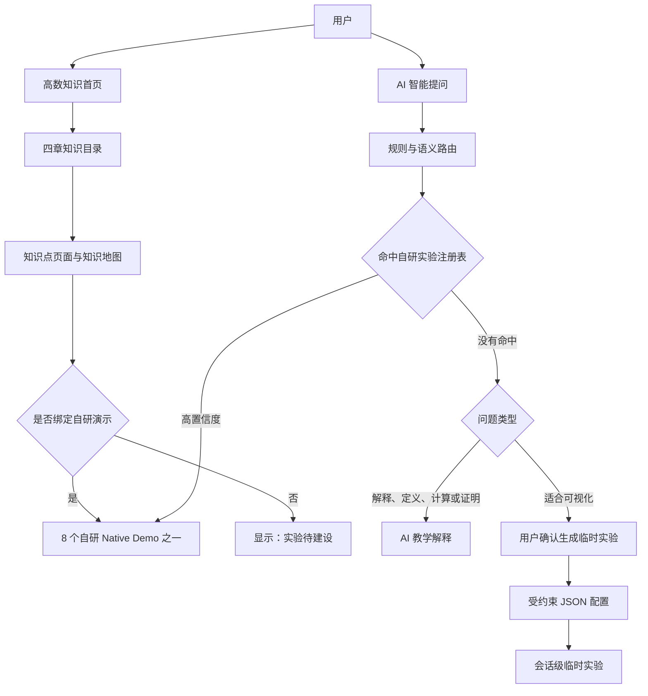
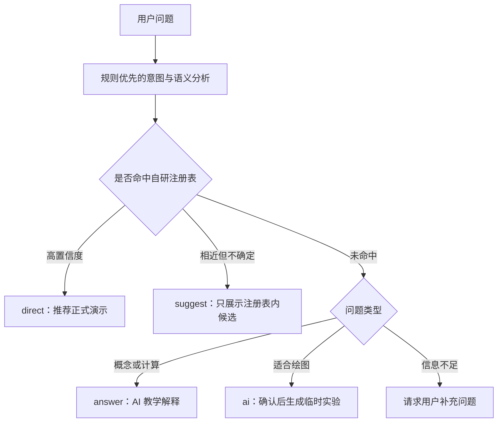
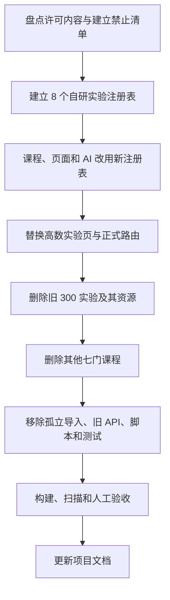

# 旧实验许可清理与高等数学范围收敛设计规格

> 状态：已确认设计，尚未实施业务代码变更
>
> 日期：2026-08-14
>
> 适用仓库：数学教学可视化展示系统建设方案
>
> 基准分支：`feat/ai-agent-experiment-v2-and-multicourse-knowledge-map`

## 1. 背景

当前项目包含一套约 300 个数学可视化实验，以及与之配套的实验目录、清单、讲解稿、场景、音频、兼容运行时、后端检索数据、迁移脚本和测试。学校方面确认这些内容存在许可证限制，后续版本、构建产物和交付物不得继续包含它们。

同时，当前客户把产品范围收敛为“高等数学（上册）”。其他七门课程暂不建设，前端与后端都应删除其正式课程数据。AI 提问能力不受这一课程范围限制，仍允许回答一般数学问题，并可在没有正式实验时生成会话级临时实验。

本次变更不是简单隐藏菜单，而是对未来版本进行许可边界清理和产品范围重构。

## 2. 已确认的决策

### 2.1 许可边界

彻底删除旧 300 个实验及其专属资源，包括：

- 旧实验 React 源码；
- Catalog、Manifest、索引、关键词、别名和路由；
- 讲解稿、教学场景、旁白数据和音频资源；
- 旧实验库页面、分类、数量和难度体系；
- 旧实验专用的兼容层、迁移脚本、生成脚本、QA 与测试；
- 后端旧实验查询、管理、LowDB 数据及 Agent 检索数据；
- 文档和界面中的“300 个实验”等过时表述。

不重写 Git 历史。历史提交仍可用于追溯，但从本次变更后的工作树、构建产物和交付包开始，不得再包含旧实验内容。

### 2.2 保留的通用能力

下列不属于旧 300 个实验内容的通用框架继续保留：

- `ExperimentShell`；
- `ExperimentCard`；
- `PlayerBar`；
- `DemoHeader`；
- 截图与全屏等通用页面能力；
- 高数知识地图和课程首页；
- AI 智能提问；
- DeepSeek、Qwen 及主备模型调用；
- AI 临时实验的受约束配置、校验与动态渲染；
- 当前通用 Bug 反馈入口（不恢复旧实验专属设计）。

与旧实验绑定的 Narration 内容和入口删除。`PlayerBar` 作为通用框架保留，后续可重新接入项目组自有讲解内容。

### 2.3 当前正式课程范围

正式课程只保留“高等数学（上册）”，包含以下四章：

1. 函数、极限与连续；
2. 导数与微分；
3. 微分中值定理与导数的应用；
4. 不定积分与定积分。

其他七门课程的前端数据、后端数据、知识关系、筛选逻辑、导航入口和专属测试全部删除，不采用隐藏或归档方式保留。

### 2.4 当前可保留的自研演示

项目组确认以下 8 个 Native Demo 为自研内容，可以继续作为正式演示：

1. ε–δ 极限定义；
2. 极限运算法则；
3. 两个重要极限；
4. 无穷小；
5. 导数的几何意义；
6. 微分；
7. 罗尔定理；
8. 函数图形描绘。

## 3. 目标与非目标

### 3.1 目标

- 未来仓库版本和构建交付物中不再包含旧 300 个实验及其资源；
- 正式课程范围统一为高等数学（上册）四章；
- 建立唯一、可验证的自研实验注册表；
- 首页以知识点和知识地图为中心，不默认锁定某个知识点；
- “高数实验”只展示项目组有权使用的正式演示；
- AI 只能把用户导航到注册表中的正式演示；
- AI 继续回答一般数学问题，并保留会话级临时实验生成；
- 前后端、测试、脚本和文档保持一致。

### 3.2 非目标

- 本次不补齐四章中所有知识点的正式实验；
- 本次不开发其他七门课程；
- 本次不重新制作被删除实验的替代版本；
- 本次不重写 Git 历史；
- 本次不把 AI 临时实验自动转为正式实验；
- 本次不扩展新的讲解稿或音频系统。

## 4. 总体架构



正式实验和临时实验必须严格分离：正式实验来自自研注册表，临时实验来自当次 AI 生成且不持久注册。

## 5. 自研实验注册表

### 5.1 设计目的

现有系统中，课程数据、实验 Catalog、前端路由和 Agent Manifest 可能分别维护实验信息，容易出现旧数据残留或模型推荐不存在的页面。新架构使用一份明确白名单作为正式实验的唯一可信来源。

### 5.2 建议字段

注册表每条记录至少包含：

```ts
interface OwnedExperimentEntry {
  id: string;
  title: string;
  knowledgePointId: string;
  route: string;
  rendererId: string;
  source: "self-developed";
  status: "available";
}
```

当前注册表只能包含已确认的 8 个自研演示。新增正式实验时，开发者必须先完成实现和审核，再登记到注册表。

### 5.3 使用范围

以下功能必须从同一注册表或由其生成的安全清单取数：

- “高数实验”页面；
- 知识点与 Renderer 的绑定；
- 正式演示路由；
- AI 现有实验匹配；
- Agent 可返回的实验 ID；
- 正式实验数量统计；
- 完整性 QA。

### 5.4 默认拒绝

正式演示入口只有在以下条件全部满足时才能显示：

1. ID 存在于自研注册表；
2. Renderer 实际存在；
3. 状态为 `available`；
4. 来源为 `self-developed`；
5. 知识点绑定有效。

未知 ID、模型编造的 ID、遗留路径和未完成 Renderer 一律不能形成“进入演示”按钮。

## 6. 高数课程与导航设计

### 6.1 首页

- `/` 保持“知识地图 + 知识点导航”的产品形态；
- 当前版本不展示课程选择器；
- 页面首次进入时不默认选择“函数的极限”或其他知识点；
- 未选择知识点时，主区域提示用户从左侧目录开始；
- 选择知识点后加载其知识地图、简介、学习目标和实验状态；
- URL 保存稳定的知识点 ID，以支持前进、后退和分享；
- 没有知识点参数时显示未选择状态。

### 6.2 左侧目录

目录采用现有的“章节 → 小节 → 知识点”层级，不使用 Linux Tree 风格。

- 四个章节均可独立展开和收起；
- 小节均可独立展开和收起；
- 点击知识点进入知识点页面，不直接进入实验；
- 从实验页打开目录并点击知识点时，返回对应知识点页面；
- 用户在知识点页面自行决定是否进入演示。

### 6.3 知识点状态

知识点分为两种明确状态：

| 状态 | 页面表现 | 行为 |
| --- | --- | --- |
| 已绑定自研演示 | “进入演示” | 打开对应 Native Demo |
| 尚未绑定演示 | “实验待建设” | 不创建链接，不跳转旧实验 |

知识地图可以展示完整的四章知识体系、先修关系和相关关系，但关系本身不能被用来推断一个不存在的正式实验路由。

### 6.4 面包屑

面包屑只展示当前真实课程和知识层级，例如：

```text
首页 > 高等数学（上册） > 导数与微分 > 导数的几何意义
```

不再出现其他课程，也不保留旧实验库的层级文案。

## 7. “高数实验”页面

原“浏览全部 300 个可视化实验”入口改为“高数实验”。

- 路由可以继续使用 `/experiments`，但页面语义改为自研高数实验库；
- 首版只展示 8 个自研演示；
- 页面数据来自自研实验注册表；
- 不展示旧难度、旧分类、旧课程或“300 个”统计；
- 后续新增自研演示后，通过注册表自动加入；
- 不为“实验待建设”的知识点生成空卡片或假页面。

## 8. AI 路由与 Agent 设计

### 8.1 AI 范围

AI 提问范围保持为一般数学，不局限于高等数学。课程导航范围和 AI 知识回答范围相互独立。

- 命中自研高数演示：可以推荐正式演示；
- 其他数学概念、定义、计算或证明问题：可以正常解释；
- 没有正式演示但适合可视化：可以建议生成临时实验；
- 不能把其他课程问题导航到不存在的正式课程页面。

### 8.2 决策流程



现有分支名可以继续兼容当前前后端协议，但每个正式实验候选都必须再次通过注册表验证。

### 8.3 正式推荐响应

正式实验推荐结果需要带有可验证来源，例如：

```json
{
  "branch": "direct",
  "match": {
    "id": "epsilon-delta",
    "title": "ε–δ 极限定义",
    "route": "/demo/epsilon-delta",
    "source": "self-developed"
  }
}
```

前端不得直接信任模型输出的路由字符串。模型输出先转换为注册表 ID，再由程序读取安全路由。

### 8.4 Agent 清理范围

删除：

- 旧 300 实验 Manifest；
- 旧实验关键词、别名、标题、路径和参数模板；
- 旧实验搜索索引和搜索工具；
- 其他七门课程的正式导航数据；
- 返回旧路径的兼容逻辑；
- 旧实验内容在提示词中的引用。

保留并收敛：

- 当前实际挂载的 Agent API；
- 数学意图识别；
- 规则优先、模型补充的路由方式；
- DeepSeek/Qwen 主备调用；
- AI 教学解释；
- 临时实验配置生成、验证和动态渲染；
- 对 8 个自研演示的匹配。

## 9. 临时实验

### 9.1 与正式实验的区别

临时实验：

- 由用户当次问题触发；
- 用户确认后生成；
- 使用受约束 JSON 配置，不直接执行模型生成的 React 源码；
- 经过后端结构和数学表达式校验；
- 保存在浏览器当前会话中；
- 不自动加入课程、知识点或“高数实验”；
- 会话结束或刷新后允许失效。

正式实验：

- 由项目组开发和审核；
- 有真实 Renderer；
- 绑定知识点；
- 登记到自研实验注册表；
- 才能作为正式入口展示。

### 9.2 安全边界

临时实验继续使用现有受约束配置和渲染机制，不回退到让模型直接生成任意前端代码的旧方案。未知组件、未知表达式和无效参数必须在服务端校验阶段被拒绝或规范化。

## 10. 旧地址与兼容行为

- 删除宽泛的 `/:experimentId` 旧实验猜测路由；
- 旧实验地址不再加载 Legacy 页面；
- 已下线地址显示明确的“该实验已下线”说明，或统一引导到“高数实验”；
- 8 个自研演示使用明确、可验证的路由；
- 未知知识点和未知 Renderer 不允许回退到旧实验；
- 不保留 `LegacyExperimentRuntime` 作为隐性兼容入口。

采用明确下线提示比静默跳转更利于用户理解，也更便于 QA 发现遗留链接。

## 11. 迁移实施顺序



实施必须遵循“新白名单先接管、旧内容后删除”，但最终交付物中不得并存两套正式实验运行体系。

## 12. 删除范围清单

实施阶段需要根据实际依赖扫描确认具体文件，删除对象至少包括：

### 12.1 前端

- `client/src/experiments/` 中旧实验目录及旧 Catalog/Home；
- 仅服务旧实验的 Legacy Registry、Compatibility Runtime 和映射；
- 旧讲解稿、场景、旁白索引与音频资源；
- 旧实验库页面、筛选、数量和难度展示；
- 旧实验动态导入和宽泛路由；
- 旧实验专用测试和迁移辅助代码；
- 其他七门课程及其知识数据。

保留目录中若同时存在通用动态实验能力，必须先拆分通用部分，再删除旧内容；不得因为目录名称相同而误删 AI 临时实验 Renderer。

### 12.2 后端

- 旧实验 Manifest、核心元数据和语义检索配置；
- 旧实验查询/管理 API 和 LowDB 数据；
- 未挂载或落后于当前 Agent 的旧 `/api/route`、`/api/generate` 实现；
- 旧实验搜索工具、评测数据、别名、参数和提示词；
- 其他七门课程的内容数据和关系；
- 与上述内容一一绑定的测试、脚本和生成产物。

删除 API 前需要先确认当前前端没有调用它；只保留当前真实使用的 Agent、Answer 和 Generate 流程。

### 12.3 脚本与文档

- 仅用于旧 300 实验迁移、兼容、质量修补和统计的脚本；
- 旧实验专用 QA、测试快照和备份生成逻辑；
- README、技术文档和文件索引中的过时架构描述；
- 构建或交付流程中会重新生成旧 Manifest/资源的任务。

## 13. 数据与状态迁移

- 正式课程数据只保留一门课程和四章；
- 知识点不再保存旧 `experimentPath`，改为可选的 `rendererId` 或等价安全引用；
- 没有 Renderer 的知识点保留知识内容和关系，但状态为“实验待建设”；
- AI 会话状态继续使用当前会话级存储；
- 不迁移旧实验用户数据到新注册表；
- 旧 LowDB 实验数据随旧 API 一并退出未来交付版本。

## 14. 验证标准

### 14.1 自动化检查

完成实现后至少满足：

- 旧实验目录数量为 0；
- 旧实验 Manifest 条目数量为 0；
- 旧讲解稿、音频和场景资源数量为 0；
- 正式课程数量严格为 1；
- 正式课程名称为“高等数学（上册）”；
- 章节数量严格为 4；
- 自研实验注册表条目数量严格为 8；
- 8 个条目全部解析到真实 Renderer；
- “实验待建设”知识点不产生路由；
- Agent 正式推荐结果均属于自研注册表；
- 代码中不存在旧实验的动态导入或路由注册；
- 构建产物不包含旧实验标题、资源或 Manifest；
- 前端 ESLint、TypeScript 检查和生产构建通过；
- 后端 TypeScript 检查、测试和启动检查通过。

应增加一个许可边界只读扫描器或等价测试，用明确的禁止路径、旧清单文件名和旧资源目录进行检查。该扫描器不得自动恢复、迁移或复制旧内容。

### 14.2 人工验收

1. 打开 `/` 时没有默认选中知识点；
2. 四章和各小节可以独立展开、收起；
3. 点击知识点只进入知识地图，不自动进入实验；
4. 已有自研演示的知识点显示“进入演示”；
5. 其他知识点显示“实验待建设”；
6. “高数实验”只展示 8 个自研演示；
7. 从演示页目录点击知识点时返回知识点页面；
8. AI 可以解释一般数学问题；
9. AI 只能推荐 8 个自研正式演示；
10. 没有正式实验时可以确认生成会话级临时实验；
11. 浏览器返回 `/ask` 时保留当次提问状态，刷新后不保留；
12. 旧实验链接不会加载旧页面或兼容运行时。

## 15. 错误处理

- 注册表存在但 Renderer 缺失：该实验标记为不可用，界面不显示进入按钮，并在开发环境报告配置错误；
- Agent 返回未知实验 ID：丢弃正式导航结果，转为解释、临时实验建议或无匹配状态；
- 课程数据加载失败：只允许回退到自有的高数本地数据，不回退旧多课程数据；
- 访问旧实验路径：显示下线提示，不启动 Legacy Runtime；
- 临时实验配置校验失败：向用户说明无法生成，并允许调整问题，不创建半成品正式入口；
- 外部模型不可用：沿用当前主备模型和真实错误处理策略，不伪装成正式实验匹配成功。

## 16. 风险与控制

| 风险 | 控制措施 |
| --- | --- |
| 删除旧目录时误删动态实验通用组件 | 先建立依赖清单，把通用 Renderer 移出旧目录后再删除 |
| 旧实验通过 Agent Manifest 重新出现 | 正式推荐只接受自研注册表 ID，并扫描生成产物 |
| 课程数据仍引用旧 `experimentPath` | 数据类型和 QA 禁止旧字段产生正式入口 |
| 前端、后端各自维护不同清单 | 以单一注册表或由其生成的清单为唯一来源 |
| 历史旧链接产生空白页 | 使用明确下线提示页和可观测的 404/下线行为 |
| 文档继续声称有 300 个实验或八门课程 | 把文档扫描纳入交付检查 |
| 旧脚本重新生成许可内容 | 删除相应生成器，并在许可边界扫描中检查产物 |

## 17. 文档更新要求

实施完成后更新：

- 根 README；
- 项目技术开发文档；
- 项目文件索引；
- API 总表；
- 前端页面路由总表；
- 新增正式实验教程；
- 当前完成范围与待建设说明；
- 环境变量和 AI 调用说明。

文档必须明确区分：

- 8 个自研正式演示；
- 四章中尚待建设的实验；
- AI 会话级临时实验；
- 已因许可要求从未来版本移除的旧实验体系。

## 18. 完成定义

只有同时满足以下条件，任务才算完成：

1. 业务运行时只存在自研正式演示和 AI 临时实验两类实验；
2. 正式课程只有高等数学（上册）四章；
3. 正式实验注册表只有 8 个已确认演示；
4. 旧 300 实验及其专属资源不在工作树、构建产物或交付包中；
5. Agent 无法推荐任何注册表外正式实验；
6. 自动检查和人工验收全部通过；
7. 文档与新架构一致；
8. Git 历史未重写，且未合并到 `main`。
